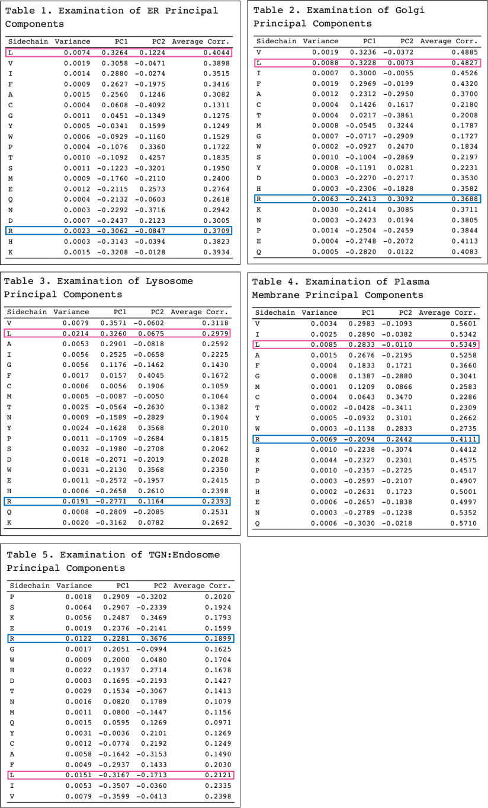

<!--This README is for the STAT223 Multivariate Analysis final project-->

# Amino Acid Composition of Single Pass Transmembrane Domains

*The purpose of this assignment was to demonstrate various techniques of multivariate statistics.  I chose to examine whether specific amino acids were favored at particuluar locations within transmembrane helices, because I wondered if any amino acid sequence would function to simply span a membrane. It turns out that chemically similar amino acids may be interchangeable at several positions within a transmembrane domain, but not any old sequence will do for a transmembrane domain.*

## Introduction

The cell membrane is formed by a lipid bilayer that forms a hydrophobic barrier between the cytoplasm and the extracellular environment.  The evolution of lipid bilayers made life as we know it possible, for this advancement permitted the concentration of biomolecules within a confined space and enabled biochemical reactions within a regulated chemical environment.  However, the lipid bilayer also necessitated the development of transmembrane proteins to allow cells to exchange nutrients and wastes with their environments, sense extracellular chemicals, and respond to them appropriately. Transmembrane (TM) proteins, also known as integral membrane proteins, span lipid bilayers and function as anchors to the extracellular matrix, points of cell-cell contact, and receptors for diffusible signals secreted by other cells.  They have both an extracellular domain, which acts as a receptor of signaling molecules and an intracellular domain that transmits the reception of the signal to the cell through a cascade of intracellular signal transduction proteins.  This often results in some change in cellular behavior, such as the opening of ion channels, the movement of the cell, or a change in gene regulation.  One distinguishing feature of TM proteins is the number of TM domains that they use to span the lipid bilayer.  From as few as one to more than ten alpha helical segments of amino acids may traverse the membrane in between the extracellular and intracellular domains. TM domains do not necessarily act as inert segments bridging active extracellular and intracellular domains across the lipid bilayer, but are often intimately involved in the mechanisms cell signaling, especially in the case of ligand-gated channels, but also in the case of single-pass TM proteins, where only a single helical region mediates the communication to the proteins on the inside that something has happened outside the cell .

In this report we review our analysis of data describing the abundance of each amino acid at each of 35 positions within single pass TM domains from a total of 1192 vertebrate proteins that are localized either to the endoplasmic reticulum, Golgi, trans-Golgi network/endosomes, lysosomes, or the plasma membrane.  We were particularly interested in answering the following questions:

1. How do the chemical properties of amino acids dictate their variation within TM domains across intracellular locations?

2. Which positions within TM domains vary the most as well as the least?

3. How does amino acid abundance at positions within TM domains vary with intracellular location?

## Data Description

Data were obtained from the supplementary material accompanying the paper by Sharpe, H.J, Stevens, T.J, and Munro, S. *Cell* **142**, 158–169, July 9, 2010.  We examined the data for multivariate normality, univariate and multivariate analysis of variance, principal component analysis, and factor analysis.  Data consist of matrices of the frequencies of each of the 20 amino acids in single pass TM domains beginning at 5 positions extracellular to the lipid bilayer through up to 9 positions intracellular to the bilayer.  The end of the most hydrophobic region normally embedded within the membrane is known to vary with intracellular compartment, such that TM domains vary in length between 16 and 24 amino acids.

## Descriptive Statistics

We generated descriptive statistics for our data grouped by intracellular location across all positions in TM domains.  There were no missing values in the data. The range of frequencies of each amino acid varied by intracellular location.  All amino acids had a minimum frequency of zero in TM domains of proteins localized to the TGN:Endosomes and lysosomes, but not in proteins localized to the ER, Golgi, or plasma membrane.  In proteins localized to the ER and plasma membrane, several hydrophobic amino acids (I, L, V, F), the non-polar amino acids (A, G, P), and the polar-uncharged amino acids (C, S, T) were indispensable for TM domains, as they had non-zero minimum frequencies. Only in lysosomes and the TGN:Endosomes does it appear that no single amino acid is essential in TM domains.  The amino acid reaching the highest frequency in each location was leucine (L).

## Multivariate Normality

We examined pair plots of raw data for evidence of normality among chemically similar amino acids.  As shown in the plots below, the distributions of several amino acids is heavily right skewed.  None of the amino acids are univariate normal across all locations.  

The only amino acids that are normally distributed when location is restricted to the ER are I, L, V, F, C, A, G, P, which are all either hydrophobic or non-polar.  When location is restricted to the Golgi L, W, C, A, G, T, S are univariate normal, and when location is restricted to the plasma membrane L, C, G, T, and M are univariate normal.  Valine and alanine are the only normally distributed amino acids when location is restricted to lysosomes and TGN:Endosomes, respectively.  The only data that are multivariate normal without any transformation are the observations for location restricted to lysosomes (Mardia Skewness = 1276.191, p-value = 0.9999 and Mardia Kurtosis = 1.764, p-value = 0.0778).  The largest of the other p-values was 3.125 x 10-05.  No multivariate outliers were detected for the raw data.  Given these findings, we decided to log transform the data (logit transformation yielded similar results, not shown).

Log transformation was generally effective in establishing multivariate normality, as shown above and by Q-Q plots (not shown).  Although log transformed data restricted by location to the ER or to the plasma membrane only passed the Mardia Kurtosis test (statistic = 0.1763, p-value = 0.860 and statistic = -0.3741, p-value = 0.7083, respectively), log transformed data restricted by location to the Golgi, lysosomes, and the TGN:Endosomes were multivariate normal. Unfortunately, transformation of the data introduced multivariate outliers and several observations for various positions within TM domains for Golgi and TGN:Endosome data were filtered out reducing the number of observations for both locations to 7. This prevented us from applying the Box’s M test for homogeneity of the variance to the full dataset, given that there were fewer observations than variables for Golgi and TGN:Endosome locations.  Nevertheless, Box’s M test on data restricted by location to the ER, lysosomes, and plasma membrane still fails with a test statistic of 3590 for 840 degrees of freedom, p-value < 2 x 10-16.  Thus, it is likely that there is no common covariance matrix for the full data.

## MANOVA

We grouped data by hydrophobic, neutral, polar, and charged amino acids and performed MANOVA tests to examine how the distribution of chemically similar amino acids TM domains varies by intracellular location, testing the H0: the mean vectors of amino acid frequencies across positions of TM domains are the same for different intracellular locations. Wilks lambda statistics all gave p-values less than 2 x 10-16, indicating that at least one mean vector was unlike the others. We also performed MANOVA analyses to test H0: the mean vectors of amino acid frequencies are the same for all positions within TM domains.  Hydrophobic, neutral, and polar amino acids gave p-values of 0.46, 0.24, and 0.23, respectively.  Thus, we do not reject H0 and conclude that mean amino acid frequencies for these amino acids do not vary by position within TM domains, or basically that any one of these amino acids may be found at any position within TM domains. However, charged amino acids gave a p-value of 0.073, indicating that the frequencies of charged amino acids differs significantly across positions within TM domains. This matches what is seen in the raw data and in figures below, where several charged amino acids are completely excluded from positions near the centers of TM domains.

To better understand if the frequencies of specific amino acids varied across positions by intracellular location, we performed univariate ANOVA on each amino acid. Not a single amino acid gave an ANOVA p-value greater than 2 x 10-16, thus we reject H0 and conclude that each amino acid’s frequency within TM domains varies by intracellular location. We also performed univariate ANOVA to examine the variation in the frequencies of amino acids by position within TM domains across intracellular locations.  The only amino acids that yielded p-values leading us to reject the null hypothesis that mean frequency of the selected amino acid is the same for different positions within TM domains were A (p-value = 0.041), P and S, (p-values < 2 x 10-16), and D (p-value = 0.046). Even though, neutral amino acids passed the MANOVA tests, these three neutral amino acids are not distributed equally across TM domains.  Additionally, the near failure of the MANOVA test by charged amino acids is due solely to the negatively charged amino acid aspartate.

## Distribution of Each Amino Acid by Position per Location

Given the results of the MANOVA and ANOVA analyses, we prepared plots of the frequency of each amino acid by position within TM domains for each intracellular location, as shown below.  The hydrophobic amino acids I, L, V, and F all show increased frequencies in the center of TM domains and reduced abundances near the ends, closer to either extracellular or intracellular regions.

The aromatic amino acids tryptophan (W) and tyrosine (Y) have similar distributions within ER-resident and Golgi-resident protein TM domains, except for the higher abundance of Y closer to the cytoplasmic side in the Golgi.  W is largely excluded from the interior of TM domains within lysosomes and the TGN:Endosomes, less so for the less bulky Y.  Glycine (G) and alanine (A) are easily incorporated into helical domains, like single pass TM domains, and appear to be more abundant within central regions of TM domains, more so for the more hydrophobic A in all locations.  

The sulfur containing cysteine (C) and methionine (M) appear to have frequencies that vary less across TM domains in all locations, and except for proteins within the plasma membrane in the case of M, neither C nor M appear to be favored nor totally excluded from TM domains.   The polar, neutral serine (S) and threonine (T) appear to be well accommodated within TM domains of lysosomal- and TGN:Endosomal-resident proteins.  

There is a strong bias for proline (P) in the intracellular half of TM domains and the ionizable histidine (H) is obviously excluded from the central portions of TM domains of proteins within all locations.  Similarly, although they are usually uncharged within the cytoplasm, asparagine (N) and glutamine (Q) are not favored within TM domains, particularly in proteins within lysosomal and TGN:Endosomal membranes, probably because these amino acids may be protonated, and thus charged given the low pH of these compartments. 

Lastly, the negatively charged aspartate (D) and glutamate (E) and the positively charged lysine (K) and arginine (R) are permitted within T domains only at their extreme termini.  It is important to note, as shown by the MANOVA tests, the distributions of all amino acids vary by location.

## Correlation Plots by Intracellular Location

We examined correlation matrices for data grouped by intracellular location.  It was not surprising to see that frequencies of amino acids with similar chemical properties within TM domains are correlated (outlined by squares in plots below).  

Correlations are strongest for hydrophobic and for charged amino acids, suggesting that the chemical properties of these amino acids strongly determine their locations within TM domains.  The number of groups of strongly correlated amino acids appears to differ by location, with the most being found among proteins within lysosomes and the fewest among the proteins of the ER and TGN:Endosomes.  Notice how hydrophobic amino acids are positively correlated with each other but negatively correlated with charged amino acids.

## Principal Component Analysis

We performed principal component analysis using correlation matrices to see if we could cluster amino acids within TM domains based on their chemical properties.  Scree plots shown below indicate that most of the variance of the data grouped by location is accounted for by the first two PCs.  

### Scree Plots

### Principal Components by Organelle 

**Leucine (hydrophobic) and Arginine (charged) highlighted**

We ordered the first principal component for each location to see if a reasonable interpretation could be obtained.  Based on the tables shown above, in every case, the amino acid with the largest variance is the hydrophobic leucine (L) and the amino acid with the second largest variance is the positively charged arginine (R).  Thus, it appears that the principal components are capturing the disparate chemical properties of the amino acids, as their position within TM domains seems to be strongly dependent on their hydrophobicity or lack thereof (charge).  Hydrophobic amino acids all have the largest positive values, while charged amino acids all have the largest negative values.  This trend is apparent in the plots of the first and second PCs shown below, where **amino acids are color-coded by chemical properties: hydrophobic in purple, positively charged in blue, negatively charged in red, neural in green, yellow, and orange**. The underlying basis of PC2 is unclear and requires further study.

### Plots of PC1 vs. PC2 by Organelle

## Factor Analysis

We performed factor analysis as a complementary technique to principal component analysis and to see if we could reveal underlying commonalities to the amino acids that may determine their distributions within TM domains in proteins in different intracellular locations. Scree plots all suggested that 3 factors would be sufficient to explain the variation of amino acid abundance (not shown).  However, when we examined residuals using the principal component method for varying numbers of factors, from as few as 4 to as many as 7 factors, depending on intracellular location, were necessary to reduce residuals to below 0.2.  Plots of factor loadings are shown below. The size of the points represents factor 3.

Similarities with plots of PC2 vs. PC1 are obvious, as the factor plots appear to be rotated and mirror reversed versions of the plots of the PCs.  

## Conclusion

We have analyzed data describing the frequency of each amino acid at each of 35 positions within the TM domains of single pass T proteins that reside in either the ER, Golgi, lysosomes, TGN:Endosome, or plasma membrane.  As we expected, amino acids with different chemical properties are differently distributed within TM domains.  The lipid bilayer is averse to charge - it is not thermodynamically favorable for charges to exist within a lipid bilayer.  Consequently, charged amino acids are not found within the middle of TM domains.  Rather, hydrophobic amino acids occupy these positions.  MANOVA and univariate ANOVA tests, as well as principal component analysis and factor analysis, support the notion that chemical properties dictate amino acid localization within TM domains. Simply stated, not all amino acids are equivalent to occupy space within a single pass TM domain, and their ability to do so largely depends on their hydrophobicity or lack of charge.  Different amino acids vary in abundance within TM domains depending on intracellular location, even if they are aromatic or hydrophobic.  Amino acids with similar chemical properties may be interchangeble at some positions within TM domains, but such domains have likely evolved specific sequences necessary for their roles in signal transduction.

